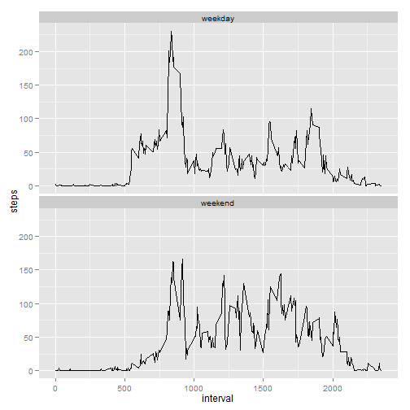

Reproducible Research - Peer Assessment 1
=========================================

## Loading and preprocessing the data


```r
library(ggplot2)

act <- read.csv("activity.csv")
act$date <- as.Date(act$date, format = "%Y-%m-%d")
```


## What is the mean total number of steps taken per day?


```r
agg_act <- aggregate(steps ~ date, data = na.omit(act), sum)
ggplot(agg_act, aes(steps)) + geom_histogram(binwidth = 1000)
```

 

```r
mean_steps <- mean(agg_act$steps)
median_steps <- median(agg_act$steps)
```


The mean total number of steps per day is 1.0766 &times; 10<sup>4</sup>.  
The median total number of steps per day is 10765.

## What is the average daily activity pattern?

First aggregate steps by interval (omitting NAs), then plot steps vs interval.


```r
agg_by_int <- aggregate(steps ~ interval, data = na.omit(act), mean)
ggplot(agg_by_int, aes(x = interval, y = steps)) + geom_line()
```

 

```r
max_steps <- max(agg_by_int$steps)
max_int <- agg_by_int[agg_by_int$steps == max_steps, "interval"]
```


The interval with the maximum number of steps is 835 (206.1698 
steps).

## Imputing missing values

Find out how many missing values there are in total:


```r
tot_missing <- sum(!complete.cases(act))
```


Total number of missing values: 2304.  

Then replace NAs with the mean for the interval in question.


```r
# Define function to change NAs to mean stepsize for given interval
na_to_mean <- function(obs) {
    if (is.na(obs["steps"])) {
        obs["steps"] <- agg_by_int[agg_by_int$interval == as.integer(obs["interval"]), 
            "steps"]
    }
    obs
}

# Replace all NAs with mean step by interval, transpose, and turn back to df
act_filled <- data.frame(t(apply(act, 1, na_to_mean)))

# Clean up a bit more
act_filled$steps <- as.numeric(levels(act_filled$steps))[act_filled$steps]
act_filled$interval <- as.integer(levels(act_filled$interval))[act_filled$interval]
act_filled$date <- as.Date(act_filled$date)
```


The filled values are noticeable by being non-integer values.  Rather than 
round, I decided to leave them as is.


```r
agg_act_f <- aggregate(steps ~ date, data = act_filled, sum)
ggplot(agg_act_f, aes(steps)) + geom_histogram(binwidth = 1000)
```

 

```r
mean_steps_f <- mean(agg_act_f$steps)
median_steps_f <- median(agg_act_f$steps)
```


The new mean total number of steps per day was 1.0766 &times; 10<sup>4</sup>.  
The new median total number of steps per day was 1.0766 &times; 10<sup>4</sup>.

The mean doesn't seem affected, but the median is slightly different.  The 
histogram was unaffected except for the median bar - it got 8 more counts from
the days whose NAs were filled.  This makes sense, since all the new additions
were "average" days.

## Are there differences in activity patterns between weekdays and weekends?

Plot steps vs interval separately for weekdays and weekends.  First create new
factor variable with values of 'weekend' or 'weekday', then plot.


```r
act_filled$day <- weekdays(act_filled$date) %in% c("Sunday", "Saturday")
act_filled[act_filled$day == TRUE, "day"] <- "weekend"
act_filled[act_filled$day == FALSE, "day"] <- "weekday"
act_filled$day <- as.factor(act_filled$day)

ggplot(act_filled, aes(x = interval, y = steps)) + stat_summary(fun.y = mean, 
    geom = "line") + facet_wrap(~day, ncol = 1)
```

 


